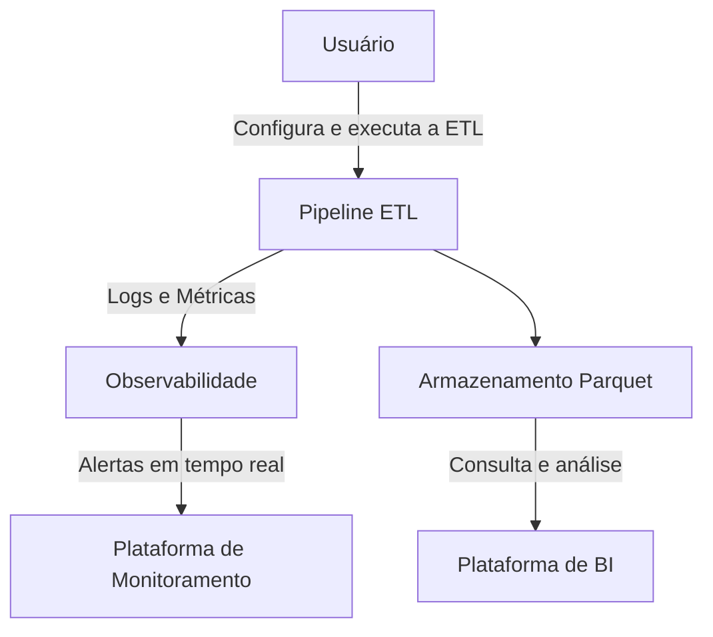

### Observabilidade ETL - Pipeline Completo

<p align="center">
  <a href="https://suajornadadedados.com.br/"></a>
</p>
<p align="center">
    <em>Nossa missão é fornecer o melhor ensino em engenharia de dados</em>
</p>

Bem-vindo a **Jornada de Dados**

# Projeto de Observabilidade: ETL Completa para Conversão de CSV em Parquet

Este repositório contém um projeto desenvolvido para implementar e monitorar uma Pipeline ETL completa que converte arquivos CSV para o formato Parquet. Focado em boas práticas de engenharia de dados, o objetivo é mostrar como observar e monitorar cada etapa da pipeline em tempo real utilizando ferramentas como logs, métricas e traces.

## Este projeto faz parte da Jornada de Dados

Assista ao vídeo completo aqui

[](https://youtube.com/live/z1EOlFV8g7g)

## Arquitetura



---

## O que você vai aprender neste projeto?

1. **Criação de uma ETL do Zero**: Como configurar e implementar uma Pipeline ETL funcional.
2. **Logs e Observabilidade**: Monitoramento detalhado para rastrear cada etapa da transformação de dados.
3. **Métricas e Traces**: Como medir desempenho e identificar gargalos em pipelines complexas.
4. **Armazenamento em Parquet**: Por que este formato é eficiente para data lakes.
5. **Integração com Ferramentas**: Como integrar logs com ferramentas como ELK Stack, Prometheus e Grafana.

---

## Pré-requisitos

1. **Python 3.8+**
2. **Bibliotecas necessárias** (disponíveis no arquivo `requirements.txt`):
   - `pandas`
   - `pyarrow`
   - `requests`
   - `logging`
   - `opentelemetry`
   - `prometheus_client`
   - `flask`
3. **Ferramentas de Monitoramento**:
   - **Grafana**: Para criar dashboards e monitorar métricas.
   - **ElasticSearch + Kibana**: Para gerenciar logs.

Para instalar as dependências:
```bash
pip install -r requirements.txt
```

---

## Estrutura do Projeto

### Módulos Principais

#### 1. **`etl.py`**
Este módulo executa as etapas principais da ETL:
- Leitura de arquivos CSV.
- Transformação dos dados.
- Escrita no formato Parquet.

#### 2. **`logger.py`**
- Implementa logs detalhados para rastrear erros e passos críticos.
- Integração com ElasticSearch para análise centralizada.

#### 3. **`metrics.py`**
- Define métricas para monitorar desempenho (tempo de execução, registros processados, etc.).
- Integração com Prometheus.

#### 4. **`tracer.py`**
- Configura traces para identificar gargalos na pipeline.
- Usa OpenTelemetry para instrumentação.

---

## Configuração

### 1. Configuração do `.env`
Crie um arquivo `.env` na raiz do projeto para configurar parâmetros necessários:
```env
LOG_SERVER=http://localhost:9200
PROMETHEUS_URL=http://localhost:9090
DATA_DIR=./data
OUTPUT_DIR=./output
```

### 2. Estrutura de Pastas
```bash
├── data/                # Diretório com arquivos CSV de entrada
├── output/              # Diretório para arquivos Parquet gerados
├── logs/                # Diretório para logs locais
├── etl.py               # Script principal da pipeline ETL
├── logger.py            # Módulo para logs detalhados
├── metrics.py           # Módulo para monitoramento de métricas
├── tracer.py            # Módulo para traces e gargalos
├── requirements.txt     # Dependências do projeto
```

---

## Como Executar?

### 1. Configurar o Ambiente
- Instale as dependências com `pip install -r requirements.txt`.
- Configure o arquivo `.env`.

### 2. Executar o Script
Para rodar a ETL:
```bash
python etl.py
```

### 3. Visualizar Logs e Métricas
- **Grafana**: Acesse os dashboards de métricas em `http://localhost:3000`.
- **ElasticSearch**: Veja os logs detalhados no Kibana.

---

## Exemplos de Monitoramento

1. **Logs**: 
   - Logs detalhados de cada etapa da pipeline.
   - Exemplo:
     ```plaintext
     INFO - Iniciando leitura do arquivo CSV: data/input.csv
     INFO - Transformação concluída: 10.000 registros processados.
     INFO - Arquivo Parquet salvo em: output/data.parquet
     ```

2. **Métricas**:
   - Total de registros processados.
   - Tempo de execução por etapa.
   - Exemplo:
     ```plaintext
     etl_records_processed_total{status="success"} 10000
     etl_execution_time_seconds{step="transform"} 2.5
     ```

3. **Traces**:
   - Identificação de gargalos.
   - Exemplo: Latência alta durante a escrita no Parquet.

---

## Extensões Futuras

- **Alertas via Telegram**: Configurar notificações automáticas em caso de falhas na pipeline.
- **Integração com Data Lake**: Adicionar suporte a armazenamento em S3 ou Azure Blob.
- **Dashboards Avançados**: Criar visualizações customizadas no Grafana.

---

## Contribuição

Contribuições são bem-vindas! Siga as etapas abaixo para colaborar:
1. Faça um fork do repositório.
2. Crie uma branch para suas alterações:
   ```bash
   git checkout -b feature/nova-funcionalidade
   ```
3. Envie um pull request.

---

### **🚀 Comece sua Jornada de Dados com Observabilidade!**